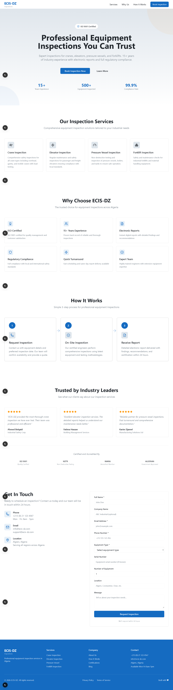

# Client Portal Dashboard - Equipment Inspection Platform

A modern, professional web application for equipment inspection services. This platform provides a seamless user experience for booking inspections, viewing services, and managing client interactions for industrial equipment inspection companies.

## 📋 Overview

**Client Portal Dashboard** is a comprehensive solution designed for professional equipment inspection services including cranes, elevators, pressure vessels, and forklifts. The platform features a modern landing page complete with service showcases, inspection booking capabilities, and full regulatory compliance documentation.

### Key Statistics

- **15+ Years** of industry experience
- **500+ Equipment** inspected
- **99.9% Compliance** rate
- **ISO 9001 Certified**

## 🎯 Features

### Core Services

- **Crane Inspection** - Comprehensive safety inspections for all crane types including overhead, gantry, and mobile cranes with load testing
- **Elevator Inspection** - Regular maintenance and safety inspections for passenger and freight elevators
- **Pressure Vessel Inspection** - Non-destructive testing and inspection of pressure vessels, boilers, and tanks
- **Forklift Inspection** - Safety and maintenance checks for industrial forklifts and material handling equipment

### Platform Capabilities

- 📱 **Responsive Design** - Works seamlessly on desktop, tablet, and mobile devices
- 🎨 **Modern UI** - Built with Shadcn UI components and Tailwind CSS
- 📝 **Inspection Booking** - Easy-to-use form for requesting inspections
- 📧 **Contact Management** - Streamlined contact and inquiry handling
- ♿ **Accessibility** - WCAG compliant design
- ⚡ **Performance Optimized** - Fast loading times and smooth interactions

## 🖼️ Screenshots

### Landing Page Preview



_The main landing page featuring hero section, services overview, and call-to-action buttons_

## 🛠️ Tech Stack

### Frontend Framework

- **Next.js 16.1.6** - React framework for production
- **React 19** - UI library
- **TypeScript** - Type-safe development

### Styling & UI

- **Tailwind CSS** - Utility-first CSS framework
- **Shadcn UI** - High-quality React components
- **Lucide React** - Beautiful icon library
- **PostCSS** - CSS processing

### Form & State Management

- **React Hook Form** - Performant, flexible form validation
- **Zod** - Schema validation

### UI Components Library

- **Radix UI** - Unstyled, accessible component primitives
- **cmdk** - Command menu component
- **Embla Carousel** - Carousels and sliders
- **Date FNS** - Modern date utility library
- **Sonner** - Toast notifications

### Additional Libraries

- **Next Themes** - Theme management
- **Class Variance Authority** - CSS utility composability

## 📦 Installation

### Prerequisites

- **Node.js** 18+ or higher
- **pnpm** 8+ (or npm/yarn)

### Setup Instructions

1. **Clone the repository**

```bash
git clone <repository-url>
cd client-portal-dashboard
```

2. **Install dependencies**

```bash
pnpm install
```

3. **Environment Setup** (if needed)

```bash
cp .env.example .env.local
```

4. **Start the development server**

```bash
pnpm dev
```

5. **Open in browser**
   Navigate to [http://localhost:3000](http://localhost:3000)

## 🚀 Getting Started

### Development

```bash
# Start development server with hot reload
pnpm dev

# Build for production
pnpm build

# Start production server
pnpm start

# Run linting
pnpm lint
```

### Project Structure

```
client-portal-dashboard/
├── app/                          # Next.js app directory
│   ├── api/                      # API routes
│   │   └── quote-request/        # Quote/inspection request endpoint
│   ├── page.tsx                  # Main landing page
│   ├── layout.tsx                # Root layout
│   └── globals.css               # Global styles
├── components/
│   ├── landing/                  # Landing page sections
│   │   ├── hero.tsx              # Hero section with CTA
│   │   ├── services.tsx          # Services showcase
│   │   ├── why-choose-us.tsx     # Value proposition
│   │   ├── how-it-works.tsx      # Process explanation
│   │   ├── contact.tsx           # Contact/booking form
│   │   ├── navigation.tsx        # Header navigation
│   │   ├── footer.tsx            # Footer section
│   │   └── social.tsx            # Social proof
│   ├── ui/                       # Reusable UI components
│   │   ├── button.tsx
│   │   ├── card.tsx
│   │   ├── form.tsx
│   │   ├── input.tsx
│   │   └── ... (40+ more components)
│   └── theme-provider.tsx        # Theme configuration
├── hooks/                        # Custom React hooks
│   ├── use-mobile.tsx            # Mobile detection
│   ├── use-toast.ts              # Toast notifications
│   └── use-window-size.ts        # Window size tracking
├── lib/
│   ├── utils.ts                  # Utility functions
│   └── mock-data.ts              # Sample data
├── public/                       # Static assets
│   ├── placeholder-logo.svg
│   └── screencapture-*.png       # Screenshots
├── styles/                       # Global styles
│   └── globals.css
├── tailwind.config.ts            # Tailwind configuration
├── next.config.mjs               # Next.js configuration
└── package.json                  # Project dependencies
```

## 🔌 API Routes

### Quote Request

- **Endpoint:** `POST /api/quote-request`
- **Description:** Submit an inspection/quote request
- **Usage:** Called when users submit the contact form

## 🎨 Customization

### Theming

The application uses Next Themes for theme management. Customize your theme in:

- `components/theme-provider.tsx` - Theme configuration
- `tailwind.config.ts` - Tailwind color scheme

### Content Updates

Landing page content can be modified in:

- `components/landing/hero.tsx` - Main headline and CTA
- `components/landing/services.tsx` - Service descriptions
- `components/landing/contact.tsx` - Contact form fields
- `components/landing/footer.tsx` - Footer information

## 📝 Configuration Files

- **next.config.mjs** - Next.js configuration (image optimization, TypeScript settings)
- **tailwind.config.ts** - Tailwind CSS theme and plugin configuration
- **tsconfig.json** - TypeScript compiler options
- **postcss.config.mjs** - PostCSS configuration for Tailwind
- **components.json** - Shadcn UI component configuration

## 🔒 Security Considerations

- Type-safe development with TypeScript
- Form validation with React Hook Form and Zod
- CORS and security headers configured
- Environment variables for sensitive data
- Next.js built-in security features

## 📱 Browser Support

- Chrome (latest)
- Firefox (latest)
- Safari (latest)
- Edge (latest)

## 🤝 Contributing

We welcome contributions! Please feel free to submit a Pull Request.

## 📄 License

This project is licensed under the MIT License - see your project's LICENSE file for details.

## 📞 Support

For support or inquiries:

- **Email:** support@example.com
- **Website:** [Your Website]
- **Phone:** [Your Phone Number]

## 🗺️ Roadmap

- [ ] User authentication and dashboard
- [ ] Inspection scheduling calendar
- [ ] Digital report generation
- [ ] Client billing portal
- [ ] Mobile app (iOS/Android)
- [ ] Real-time notifications
- [ ] Advanced analytics

## 🙏 Acknowledgments

- [Shadcn UI](https://ui.shadcn.com/) - Beautiful component library
- [Next.js](https://nextjs.org/) - React framework
- [Tailwind CSS](https://tailwindcss.com/) - Styling framework
- [Radix UI](https://www.radix-ui.com/) - Component primitives

---


_Last Updated: February 19, 2026_
